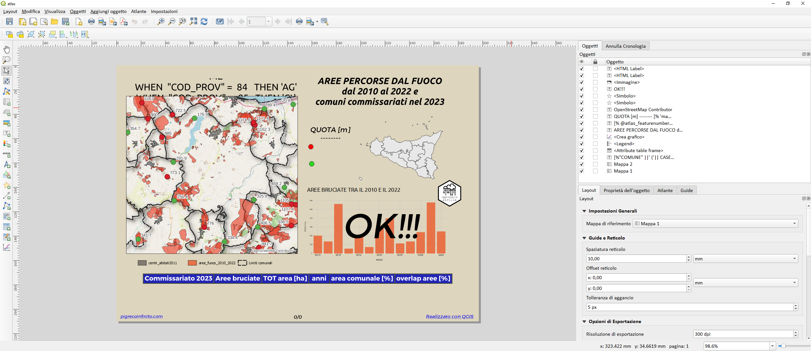
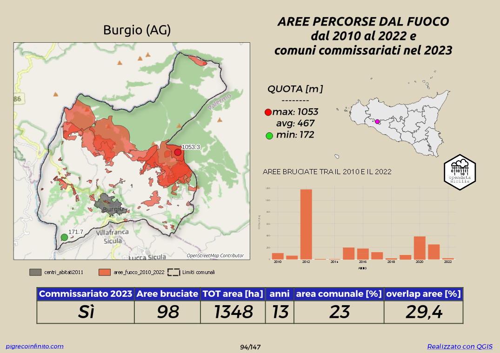
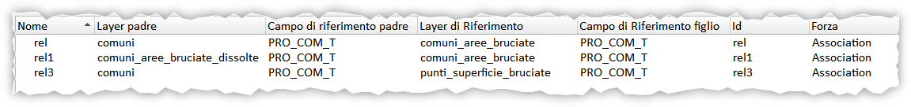
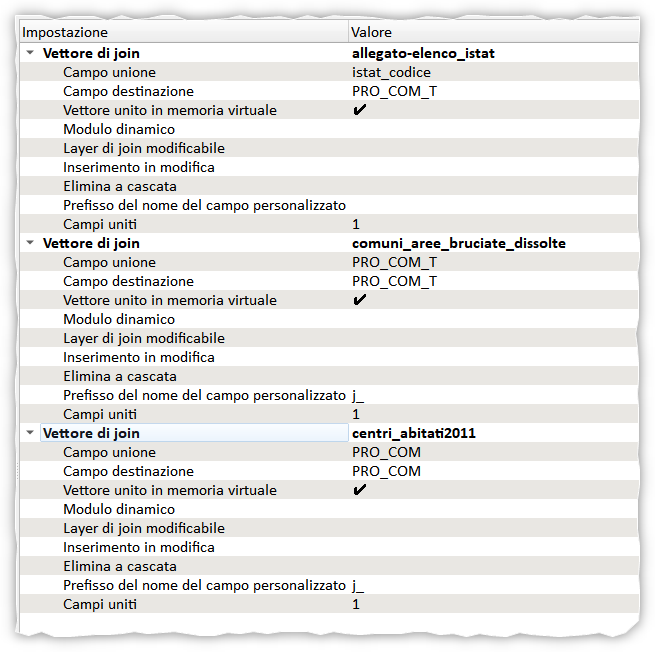
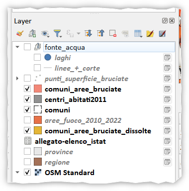

# Aree percorse dal fuoco Sicilia 2010-2022

<!-- TOC -->

- [Aree percorse dal fuoco Sicilia 2010-2022](#aree-percorse-dal-fuoco-sicilia-2010-2022)
- [INTRO](#intro)
  - [DATI](#dati)
  - [RIFERIMENTI](#riferimenti)
  - [RINGRAZIAMENTI](#ringraziamenti)
- [Espressioni usate nel filtro Atlante](#espressioni-usate-nel-filtro-atlante)
  - [trova la pagina dell'Atlante con il comune con max numero di incendi](#trova-la-pagina-dellatlante-con-il-comune-con-max-numero-di-incendi)
  - [trova la pagina dell'Atlante con il comune con max numero di incendi tra quelli commissariati](#trova-la-pagina-dellatlante-con-il-comune-con-max-numero-di-incendi-tra-quelli-commissariati)
  - [trova i comuni, con numero max di anni, percorsi da incendi e commissariati nel 2023](#trova-i-comuni-con-numero-max-di-anni-percorsi-da-incendi-e-commissariati-nel-2023)
  - [trova i comuni che non hanno mai subito incendi](#trova-i-comuni-che-non-hanno-mai-subito-incendi)
  - [trova i comuni inadempienti o commissariati](#trova-i-comuni-inadempienti-o-commissariati)
- [Progetto QGIS](#progetto-qgis)
  - [Layer](#layer)
  - [Atlante](#atlante)
    - [Tabella](#tabella)
    - [Quota](#quota)
    - [Istogramma](#istogramma)
    - [Mappa](#mappa)
- [Chi ha usato questo repository](#chi-ha-usato-questo-repository)
- [DISCLAIMER](#disclaimer)

<!-- /TOC -->

# INTRO
Analisi delle aree percorse dal fuoco in Sicilia tra gli anni 2010 e 2022 - dati SIF e Regione Siciliana

Lo scopo principale di questo repository è quello di _dimostrare_ come è semplice realizzare delle analisi usando il compositore di stampe di QGIS, e in particolare il suo atlas (stampe in serie). Attraverso questo strumento è possibile creare un semplice _layout di stampa_ e successivamente visualizzara/stampare 391 pagine una per ogni comune. I vari oggetti presenti nel template (mappa, panoramica, testo, grafico, tabella, ecc...) sono dinamici, ovvero, cambiano sfogliando l'atlante.

PRINT LAYOUT:


QGIS:


↑ [torna su](#aree-percorse-dal-fuoco-sicilia-2010-2022) ↑

## DATI

- [CONFINI DELLE UNITÀ AMMINISTRATIVE A FINI STATISTICI AL 1° GENNAIO 2023](https://www.istat.it/it/archivio/222527)
-  [Ufficio stampa della Regione Siciliana - commissari](https://www.regione.sicilia.it/la-regione-informa/incendi-nominati-commissari-catasto-aree-bruciate-nei-comuni-inadempienti)
-  [Banca dati della Regione Siciliana costituita da una serie di banche dati del settore forestale SIF (Sistema Informativo Forestale)](https://sifweb.regione.sicilia.it/arcgis/rest/services)

## RIFERIMENTI

- **QGIS**: <https://www.qgis.org/it/site/>
- **DOC QGIS**: <https://docs.qgis.org/3.28/it/docs/user_manual/>
- **PDF dell'atlante**:<https://github.com/pigreco/sicilia_brucia_2010_2022/raw/main/imgs/atlas_aree_percorse_dal_fuoco.zip>

## RINGRAZIAMENTI

- Comunità **Open Data Sicilia**: <https://twitter.com/opendatasicilia>

↑ [torna su](#aree-percorse-dal-fuoco-sicilia-2010-2022) ↑

# Espressioni usate nel filtro Atlante

Lo strumento principe per fare analisi ed estrarre dati (pagine) è il filtro presente nella scheda `Atlante`:


## trova la pagina dell'Atlante con il comune con max numero di incendi
```
maximum(relation_aggregate('rel', 'count', @id))
= 
relation_aggregate('rel', 'count', @id) 
```


↑ [torna su](#aree-percorse-dal-fuoco-sicilia-2010-2022) ↑

## trova la pagina dell'Atlante con il comune con max numero di incendi tra quelli commissariati

```
maximum(relation_aggregate('rel','count',"commissario"='Sì'))
= 
relation_aggregate('rel','count',"commissario"='Sì')
```


↑ [torna su](#aree-percorse-dal-fuoco-sicilia-2010-2022) ↑

## trova i comuni, con numero max di anni, percorsi da incendi e commissariati nel 2023

```
maximum(relation_aggregate('rel','count_distinct',"anno"))
=
relation_aggregate('rel','count_distinct',"anno")
AND 
"commissario" IS NOT NULL
```


risultato:<br>
Burgio, Carlentini, Catania, Licata, Niscemi, Randazzo, Caccamo,   Castelmola, Cefalù, Mongiuffi Melia, Ragalna, Sciacca

↑ [torna su](#aree-percorse-dal-fuoco-sicilia-2010-2022) ↑

## trova i comuni che non hanno mai subito incendi

```
relation_aggregate( 'rel', 'sum', "sup_bruciate") = 0
```
risultato:<br>
Aci Bonaccorsi, Canicattì, Castrofilippo, Favignana, Ficarazzi, Joppolo Giancaxio, Mazzarrone, Merì, Milazzo, Misiliscemi, Misterbianco, Montedoro, Pace del Mela, Petrosino, Pozzallo, Raddusa, 
Ramacca, Riposto, San Pietro Clarenza, Sant'Agata li Battiati, Scordia, Ustica, Valverde.

esempio:


↑ [torna su](#aree-percorse-dal-fuoco-sicilia-2010-2022) ↑

## trova i comuni inadempienti o commissariati

```
"commissario" is not null
```
risultato:<br>
Aci Castello, Acireale, Adrano, Agira, Alcara li Fusi, Alì, Antillo, Aragona, Assoro, Augusta, Barcellona Pozzo di Gotto, Belpasso, Brolo, Burgio, Butera, Caccamo, Calamonaci, Caltavuturo, Cammarata, Campofelice di Fitalia, Camporeale, Capizzi, Capo d'Orlando, Capri Leone, Carlentini, Casalvecchio Siculo, Castel di Iudica, Casteldaccia, Castelmola, Casteltermini, Castronovo di Sicilia, Catania, Cefalù, Centuripe, Cesarò, Comitini, Condrò, Contessa Entellina, Falcone, Favara, Ficarra, Floridia, Fondachelli-Fantina, Forza d'Agrò, Francavilla di Sicilia, Francofonte, Furci Siculo, Furnari, Gaggi, Gagliano Castelferrato, Gallodoro, Gela, Giarre, Gioiosa Marea, Giuliana, Grammichele, Graniti, Grotte, Gualtieri Sicaminò, Itala, Leni, Letojanni, Licata, Licodia Eubea, Lipari, Lucca Sicula, Maletto, Malvagna, Mandanici, Maniace, Mascali, Menfi, Milena, Militello in Val di Catania, Milo, Mineo, Mirabella Imbaccari, Monforte San Giorgio, Mongiuffi Melia, Montalbano Elicona, Montallegro, Motta Camastra, Motta Sant'Anastasia, Naro, Naso, Nicosia, Niscemi, Nissoria, Nizza di Sicilia, Novara di Sicilia, Palma di Montechiaro, Partanna, Paternò, Patti, Pettineo, Pietraperzia, Piraino, Ragalna, Randazzo, Ravanusa, Reitano, Riesi, Roccafiorita, Roccalumera, Roccapalumba, Rodì Milici, Rosolini, San Cono, San Fratello, San Giovanni Gemini, San Gregorio di Catania, San Mauro Castelverde, San Michele di Ganzaria, San Teodoro, San Vito Lo Capo, Sant'Agata di Militello, Sant'Alessio Siculo, Sant'Angelo di Brolo, Santa Cristina Gela, Santa Flavia, Santa Margherita di Belice, Santa Marina Salina, Santo Stefano di Camastra, Savoca, Scaletta Zanclea, Sciacca, Siracusa, Sperlinga, Taormina, Terme Vigliatore, Terrasini, Torregrotta, Torrenova, Torretta, Trapani, Tremestieri Etneo, Troina, Valderice, Valdina, Venetico, Viagrande, Vicari, Villafranca Sicula, Villafranca Tirrena, Vita, Vizzini, Zafferana Etnea.


↑ [torna su](#aree-percorse-dal-fuoco-sicilia-2010-2022) ↑

# Progetto QGIS

Nel progetto (_che è salvato dentro il gpkg_) sono state realizzate tre relazioni di progetto e tre join tabellari:





↑ [torna su](#aree-percorse-dal-fuoco-sicilia-2010-2022) ↑

## Layer

Nella TOC sono presenti vari layer, la descrizione è presente nelle note alla destra del nome layer:



↑ [torna su](#aree-percorse-dal-fuoco-sicilia-2010-2022) ↑

## Atlante

Nel progetto è presente un atlante (atlas) con le seguenti caratterisitiche:

layout atlante:


### Tabella


- `Commissariato 2023`: indica se il comune corrente è stato commissariato nel 2023
- `Area bruciate`: indica il numero di aree bruciate dal 2010 al 2022;
- `TOT area [ha]`: indica la somma delle supoerfici bruciate dal 2010 al 2022
- `anni`: indica il numero di anni in cui il comune corrente è stato percorso da incendi;
- `area comunale [%]`: indica la percentuale di superficie comunale (tolta l'area dei centri abitati) rispetto alla superficie delle aree bruciate nello stesso comune;
- `overlap aree [%]`: indica la percentuale di aree bruciate sovrapposte negli anni

↑ [torna su](#aree-percorse-dal-fuoco-sicilia-2010-2022) ↑

### Quota


sono quote sul livello del mare e indicano la quota massima dell'area percorsa dagli incendi del comune corrente, la minima e la quota media della singola area bruciata. (NB: i punti sono stati tracciati come point on surface per ogni aree bruciata e il calcolo della quota è stata derivata dal DTM Tinitaly)

Nel caso di Comuni che non sono mai stai percorsi da incendi le quote non saranno visibili.

↑ [torna su](#aree-percorse-dal-fuoco-sicilia-2010-2022) ↑

### Istogramma


rappesenta la superficie percorsa dal fuoco - per ogni comune - negli anni dal 2010 al 2022; in ascisse gli anni, in ordinata la somma deglle aree percorse dagli indendi per ogni anno.

Nel caso di Comuni che non sono mai stai percorsi da incendi comparirà un grande OK! al posto dell'istogramma.

↑ [torna su](#aree-percorse-dal-fuoco-sicilia-2010-2022) ↑

### Mappa


nella mappa è rappresentato, oltre al nome del comune e provincia:
- come sfondo OpenStreetMap;
- i limiti amministrativi del comune corrente;
- le aree percorse dal fuoco dal 2010 al 2022;
- l'area dei centri abitati;
- punti:
  - in rosso il punto con quota massima dell'incendio;
  - in verde il punto con quota minima dell'incendio.

↑ [torna su](#aree-percorse-dal-fuoco-sicilia-2010-2022) ↑

# Chi ha usato questo repository

- Blog post su Open Data Sicilia: <- Blog post by Open Data SIcilia: <https://opendatasicilia.it/2023/08/18/terre-percorse-dal-fuoco/>
# DISCLAIMER

Il presente contenuto è stato realizzato/aggiornato, in collaborazione con **Open Data Sicilia**, da _**Salvatore Fiandaca**_ nel mese di agosto 2023 utilizzando [QGIS 3.28 Firenze LTR](https://qgis.org/it/site/) e distribuito con licenza [CC BY 4.0](https://creativecommons.org/licenses/by/4.0/deed.it)

